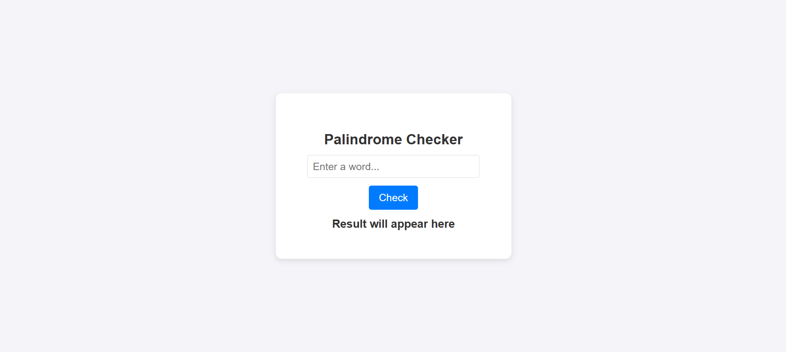

# Palindrome Checker

This is a simple web-based **Palindrome Checker** application that allows users to check whether a given word or phrase is a palindrome or not. It's designed to be easy to use, intuitive, and fun for anyone who wants to test whether their input reads the same backward and forward.

## What is a Palindrome?
A **palindrome** is a word, phrase, number, or other sequences of characters that reads the same forward and backward (ignoring spaces, punctuation, and capitalization). Some common examples of palindromes include:

- **Word Palindromes**: "madam", "racecar"
- **Phrase Palindromes**: "A man, a plan, a canal, Panama"
- **Number Palindromes**: "12321", "111"

In this application, you can check if a word or phrase is a palindrome by entering it and clicking the "Check" button.

## Preview
Here’s a preview of how the application will look:

## Features
- **Input Field**: Enter a word or phrase in the input field.
- **Check Button**: Click the "Check" button to check if the entered text is a palindrome.
- **Result Display**: After checking, the application displays whether the entered text is a palindrome or not.
- **User-friendly Interface**: Simple design and responsive interface.

## How It Works
1. **Enter a Word or Phrase**: Type a word or phrase into the input field.
2. **Click "Check"**: Press the "Check" button to check if the word or phrase is a palindrome.
3. **View the Result**: The result will be displayed below the input field:
   - If the text is a palindrome, the message will say: `"X is a Palindrome"`.
   - If not, the message will say: `"X is Not a Palindrome"`.
4. **Input Clear**: After the check, the input field is cleared for the next entry.

### Example Inputs:
- **Palindrome Example**: "madam" → "madam is a Palindrome"
- **Non-Palindrome Example**: "hello" → "hello is Not a Palindrome"

## How to Use
1. Open the webpage in your browser.
2. Type a word or phrase into the input box.
3. Click the "Check" button to see if the word or phrase is a palindrome.
4. The result will be displayed below the button, indicating whether it's a palindrome.

## Tech Stack
This project is built using:
- **HTML**: Structure of the webpage and input form.
- **CSS**: Styling for the webpage, making it modern and responsive.
- **JavaScript**: Functionality for palindrome checking, as well as handling user interactions.
  
### Libraries & Tools:
- **Vanilla JavaScript**: No external libraries are required, just pure JavaScript for functionality.
- **CSS Animations**: Smooth fade-in effects to enhance user experience.

---

### Contributing
Feel free to fork this project and submit pull requests if you want to contribute improvements, bug fixes, or new features. Suggestions and contributions are always welcome!

